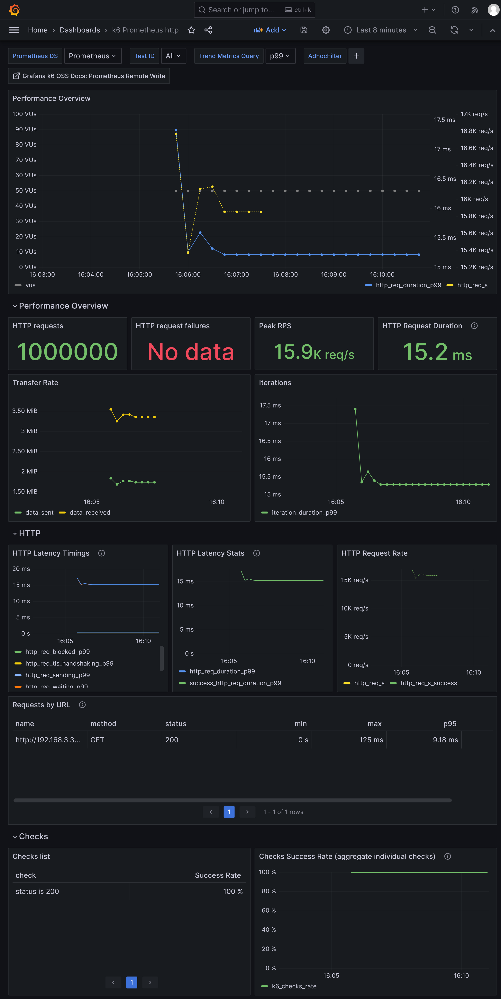
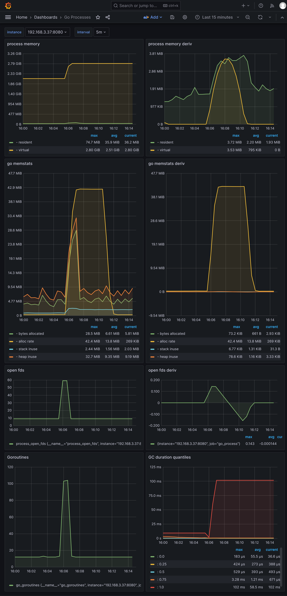
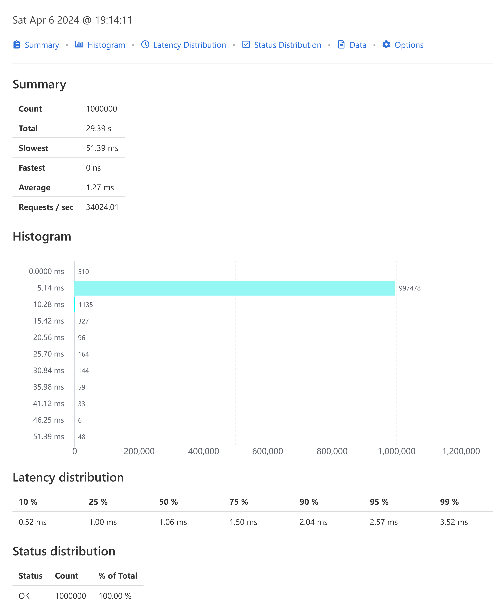

## kratos、go-zero、sponge三个微服务框架创建的http和gprc服务的性能测试

#### 主要压测指标

- **吞吐量(Throughput)**：单位时间内处理的请求数量，通常以每秒请求数(Requests per Second，RPS)表示。
- **响应时间(Response Time)**：从发出请求到收到响应的时间，包括p95、p99、avg、min、max。
- **错误率(Error Rate)**：请求处理失败或产生错误的比率。
- **资源利用率(Resource Utilization)**：包括cpu、内存、网络带宽等资源的使用情况。

<br>

#### 压测api

- **http**
    - 端口: 8080
    - 路由: /api/v1/helloworld/qwertyuiopasdfghjklzxcvbnmqwertyuiopasdfghjklzxcvbnm
    - 请求方法: GET
- **grpc**
    - 端口: 8282
    - path: /helloworld.v1.Greeter/SayHello
    - message: qwertyuiopasdfghjklzxcvbnmqwertyuiopasdfghjklzxcvbnm
    - 类型: unary

注： 8080端口的路由/metrics是采集go程序的指标。

<br>

#### 压测工具

- [**k6**](https://github.com/grafana/k6): 用来压测http服务。
- [**ghz**](https://github.com/bojand/ghz): 用来压测grpc服务。

<br>

#### 压测环境

因为不同的服务器硬件对性能测试结果不一样，本次是在宿主机和虚拟机之间进行负载测试：

- 宿主机
  - 硬件：R7 6800H CPU，16G内存
  - 用途：运行工具k6和ghz测试http api和grpc api
- VMware虚拟机
  - 系统：centos 8
  - 硬件：8核cpu、4G内存
  - 用途：用于单独运行kratos、go-zero、sponge创建的http和grpc服务

> 如果想要在自己的机器上进行负载测试，点击查看[压测说明文档](benchmark.md)。

<br>

#### 压测结果

50个并发，总共100万个请求，压测kratos、go-zero、sponge创建的`http`服务结果：


<br>

50个并发，总共100万个请求，压测kratos、go-zero、sponge创建的`grpc`服务结果：


<br>

---

### kratos 创建的服务的压测结果数据

kratos 版本 2.7.2

#### http 压测结果数据

使用压测工具k6，50个并发，总共100万次请求的结果数据：

```bash
$ K6_PROMETHEUS_RW_SERVER_URL="http://192.168.3.37:9090/api/v1/write" K6_PROMETHEUS_RW_TREND_STATS="min,max,avg,p(95),p(99)" K6_PROMETHEUS_RW_PUSH_INTERVAL=1s k6 run -u 50 -i 1000000 -o experimental-prometheus-rw http-load-test.js

  execution: local
     script: http-load-test.js
     output: Prometheus remote write (http://192.168.3.37:9090/api/v1/write)

  scenarios: (100.00%) 1 scenario, 50 max VUs, 10m30s max duration (incl. graceful stop):
           * default: 1000000 iterations shared among 50 VUs (maxDuration: 10m0s, gracefulStop: 30s)

     ✓ status is 200

     checks.........................: 100.00% ✓ 1000000      ✗ 0
     data_received..................: 137 MB  2.3 MB/s
     data_sent......................: 115 MB  2.0 MB/s
     http_req_blocked...............: avg=1.68µs  min=0s med=0s     max=10.12ms p(90)=0s     p(95)=0s
     http_req_connecting............: avg=262ns   min=0s med=0s     max=10.12ms p(90)=0s     p(95)=0s
     http_req_duration..............: avg=2.86ms  min=0s med=2.01ms max=47.44ms p(90)=6.62ms p(95)=8.68ms
       { expected_response:true }...: avg=2.86ms  min=0s med=2.01ms max=47.44ms p(90)=6.62ms p(95)=8.68ms
     http_req_failed................: 0.00%   ✓ 0            ✗ 1000000
     http_req_receiving.............: avg=20.56µs min=0s med=0s     max=4.68ms  p(90)=0s     p(95)=0s
     http_req_sending...............: avg=8.01µs  min=0s med=0s     max=3.77ms  p(90)=0s     p(95)=0s
     http_req_tls_handshaking.......: avg=0s      min=0s med=0s     max=0s      p(90)=0s     p(95)=0s
     http_req_waiting...............: avg=2.83ms  min=0s med=2ms    max=47.44ms p(90)=6.58ms p(95)=8.64ms
     http_reqs......................: 1000000 17085.130811/s
     iteration_duration.............: avg=2.91ms  min=0s med=2.02ms max=47.44ms p(90)=6.68ms p(95)=8.76ms
     iterations.....................: 1000000 17085.130811/s
     vus............................: 50      min=50         max=50
     vus_max........................: 50      min=50         max=50


running (00m58.5s), 00/50 VUs, 1000000 complete and 0 interrupted iterations
default ✓ [======================================] 50 VUs  00m58.5s/10m0s  1000000/1000000 shared iters
```

压测http api指标的grafana界面：


采集到的服务程序指标的grafana界面：


<br>

#### grpc 压测结果数据

使用压测工具ghz，50个并发，总共100万次请求的结果数据。

grpc api压测结果数据：


采集到的服务程序指标的grafana界面：


<br>

### go-zero 创建的服务的压测结果数据

go-zero 版本 1.6.3

#### http 压测结果数据

使用压测工具k6，50个并发，总共100万次请求的结果数据：

```bash
$ K6_PROMETHEUS_RW_SERVER_URL="http://192.168.3.37:9090/api/v1/write" K6_PROMETHEUS_RW_TREND_STATS="min,max,avg,p(95),p(99)" K6_PROMETHEUS_RW_PUSH_INTERVAL=1s k6 run -u 50 -i 1000000 -o experimental-prometheus-rw http-load-test.js

  execution: local
     script: http-load-test.js
     output: Prometheus remote write (http://192.168.3.37:9090/api/v1/write)

  scenarios: (100.00%) 1 scenario, 50 max VUs, 10m30s max duration (incl. graceful stop):
           * default: 1000000 iterations shared among 50 VUs (maxDuration: 10m0s, gracefulStop: 30s)

     ✓ status is 200

     checks.........................: 100.00% ✓ 1000000      ✗ 0
     data_received..................: 222 MB  3.5 MB/s
     data_sent......................: 115 MB  1.8 MB/s
     http_req_blocked...............: avg=1.67µs  min=0s med=0s     max=8.64ms   p(90)=0s     p(95)=0s
     http_req_connecting............: avg=243ns   min=0s med=0s     max=8.64ms   p(90)=0s     p(95)=0s
     http_req_duration..............: avg=3.08ms  min=0s med=2.05ms max=124.92ms p(90)=6.78ms p(95)=9.13ms
       { expected_response:true }...: avg=3.08ms  min=0s med=2.05ms max=124.92ms p(90)=6.78ms p(95)=9.13ms
     http_req_failed................: 0.00%   ✓ 0            ✗ 1000000
     http_req_receiving.............: avg=21.31µs min=0s med=0s     max=5.89ms   p(90)=0s     p(95)=0s
     http_req_sending...............: avg=8.13µs  min=0s med=0s     max=5.2ms    p(90)=0s     p(95)=0s
     http_req_tls_handshaking.......: avg=0s      min=0s med=0s     max=0s       p(90)=0s     p(95)=0s
     http_req_waiting...............: avg=3.05ms  min=0s med=2.04ms max=124.92ms p(90)=6.75ms p(95)=9.09ms
     http_reqs......................: 1000000 15887.422209/s
     iteration_duration.............: avg=3.13ms  min=0s med=2.08ms max=124.92ms p(90)=6.85ms p(95)=9.21ms
     iterations.....................: 1000000 15887.422209/s
     vus............................: 50      min=50         max=50
     vus_max........................: 50      min=50         max=50


running (01m02.9s), 00/50 VUs, 1000000 complete and 0 interrupted iterations
default ✓ [======================================] 50 VUs  01m02.9s/10m0s  1000000/1000000 shared iters
```

压测http api指标的grafana界面：



采集到的服务程序指标的grafana界面：




<br>

#### grpc 压测结果数据

使用压测工具ghz，50个并发，总共100万次请求的结果数据。

grpc api压测结果数据：



采集到的服务程序指标的grafana界面：


<br>

### sponge 创建的服务的压测结果数据

sponge 版本 1.7.0

#### http 压测结果数据

使用压测工具k6，50个并发，总共100万次请求的结果数据：

```bash
$ K6_PROMETHEUS_RW_SERVER_URL="http://192.168.3.37:9090/api/v1/write" K6_PROMETHEUS_RW_TREND_STATS="min,max,avg,p(95),p(99)" K6_PROMETHEUS_RW_PUSH_INTERVAL=1s k6 run -u 50 -i 1000000 -o experimental-prometheus-rw http-load-test.js

  execution: local
     script: http-load-test.js
     output: Prometheus remote write (http://192.168.3.37:9090/api/v1/write)

  scenarios: (100.00%) 1 scenario, 50 max VUs, 10m30s max duration (incl. graceful stop):
           * default: 1000000 iterations shared among 50 VUs (maxDuration: 10m0s, gracefulStop: 30s)

     ✓ status is 200

     checks.........................: 100.00% ✓ 1000000      ✗ 0
     data_received..................: 181 MB  3.2 MB/s
     data_sent......................: 115 MB  2.0 MB/s
     http_req_blocked...............: avg=1.75µs  min=0s med=0s     max=10.2ms  p(90)=0s     p(95)=0s
     http_req_connecting............: avg=305ns   min=0s med=0s     max=10.2ms  p(90)=0s     p(95)=0s
     http_req_duration..............: avg=2.74ms  min=0s med=2.04ms max=59.21ms p(90)=5.9ms  p(95)=7.67ms
       { expected_response:true }...: avg=2.74ms  min=0s med=2.04ms max=59.21ms p(90)=5.9ms  p(95)=7.67ms
     http_req_failed................: 0.00%   ✓ 0            ✗ 1000000
     http_req_receiving.............: avg=20.85µs min=0s med=0s     max=8.54ms  p(90)=0s     p(95)=0s
     http_req_sending...............: avg=8.55µs  min=0s med=0s     max=6.16ms  p(90)=0s     p(95)=0s
     http_req_tls_handshaking.......: avg=0s      min=0s med=0s     max=0s      p(90)=0s     p(95)=0s
     http_req_waiting...............: avg=2.72ms  min=0s med=2.02ms max=58.69ms p(90)=5.87ms p(95)=7.63ms
     http_reqs......................: 1000000 17740.077322/s
     iteration_duration.............: avg=2.81ms  min=0s med=2.07ms max=59.21ms p(90)=5.97ms p(95)=7.74ms
     iterations.....................: 1000000 17740.077322/s
     vus............................: 50      min=50         max=50
     vus_max........................: 50      min=50         max=50

running (00m56.4s), 00/50 VUs, 1000000 complete and 0 interrupted iterations
default ✓ [======================================] 50 VUs  00m56.4s/10m0s  1000000/1000000 shared iters
```

压测http api指标的grafana界面：


采集到的服务程序指标的grafana界面：


<br>

#### grpc 压测结果数据

使用压测工具ghz，50个并发，总共100万次请求的结果数据。

grpc api的压测结果数据：


采集到的服务程序指标的grafana界面：


