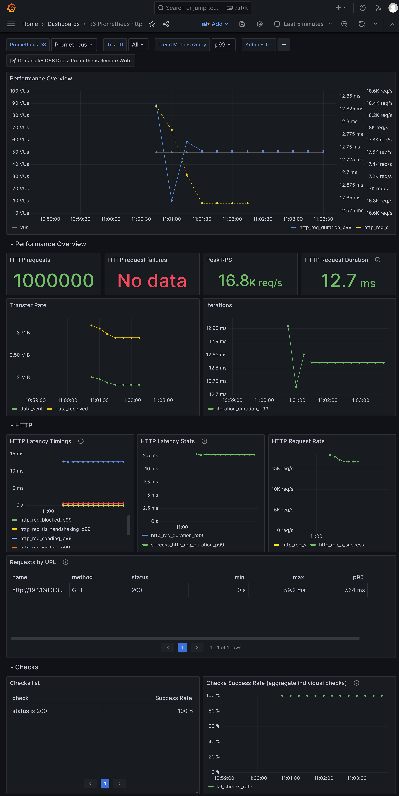
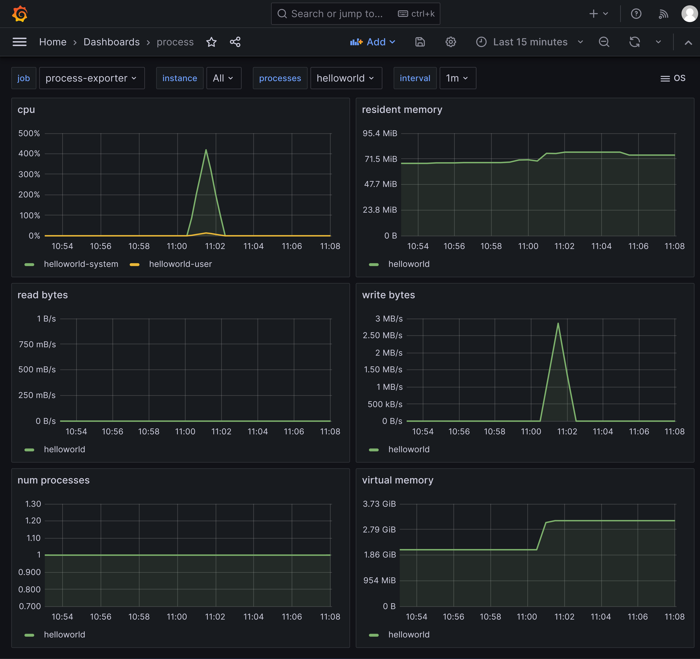
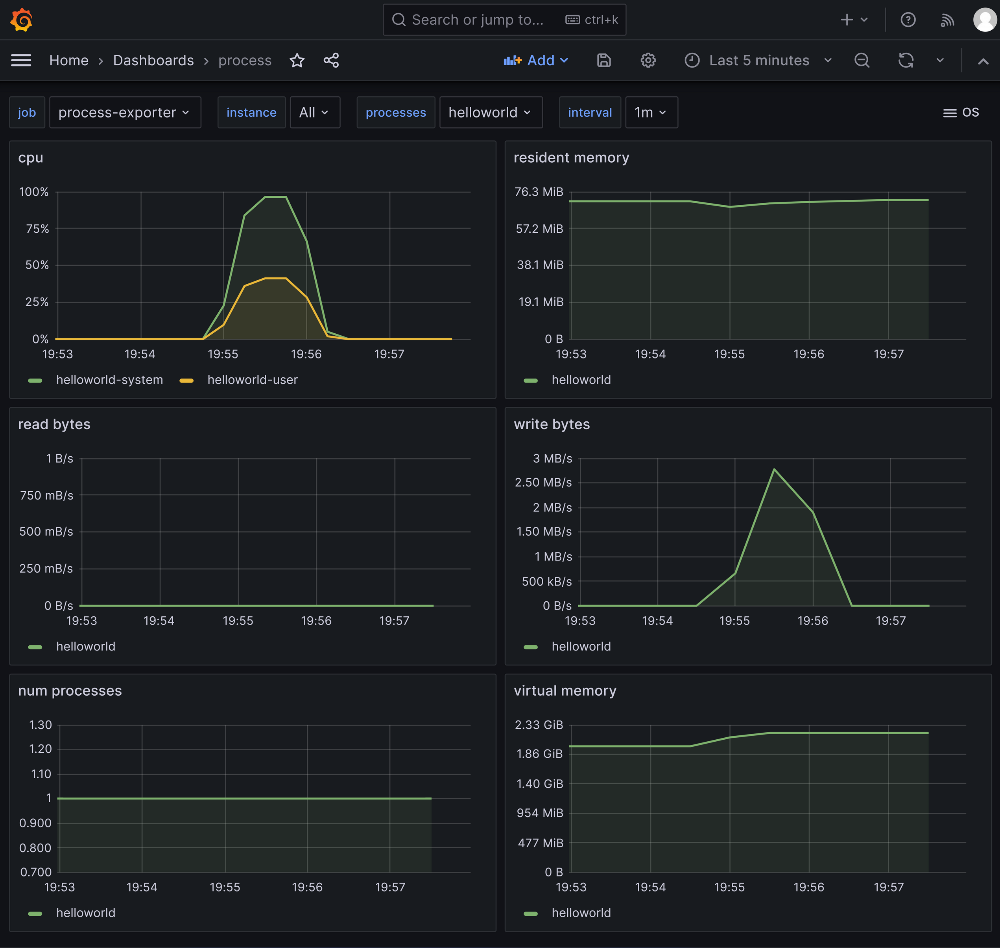

## sponge 创建的服务的压测结果

sponge 版本 1.7.0

<br>

### http 压测结果

使用压测工具k6，50个并发，总共100万次请求的结果：

```bash
$ K6_PROMETHEUS_RW_SERVER_URL="http://192.168.3.37:9090/api/v1/write" K6_PROMETHEUS_RW_TREND_STATS="min,max,avg,p(95),p(99)" K6_PROMETHEUS_RW_PUSH_INTERVAL=1s k6 run -u 50 -i 1000000 -o experimental-prometheus-rw http-load-test.js

  execution: local
     script: http-load-test.js
     output: Prometheus remote write (http://192.168.3.37:9090/api/v1/write)

  scenarios: (100.00%) 1 scenario, 50 max VUs, 10m30s max duration (incl. graceful stop):
           * default: 1000000 iterations shared among 50 VUs (maxDuration: 10m0s, gracefulStop: 30s)

     ✓ status is 200

     checks.........................: 100.00% ✓ 1000000      ✗ 0
     data_received..................: 181 MB  3.2 MB/s
     data_sent......................: 115 MB  2.0 MB/s
     http_req_blocked...............: avg=1.75µs  min=0s med=0s     max=10.2ms  p(90)=0s     p(95)=0s
     http_req_connecting............: avg=305ns   min=0s med=0s     max=10.2ms  p(90)=0s     p(95)=0s
     http_req_duration..............: avg=2.74ms  min=0s med=2.04ms max=59.21ms p(90)=5.9ms  p(95)=7.67ms
       { expected_response:true }...: avg=2.74ms  min=0s med=2.04ms max=59.21ms p(90)=5.9ms  p(95)=7.67ms
     http_req_failed................: 0.00%   ✓ 0            ✗ 1000000
     http_req_receiving.............: avg=20.85µs min=0s med=0s     max=8.54ms  p(90)=0s     p(95)=0s
     http_req_sending...............: avg=8.55µs  min=0s med=0s     max=6.16ms  p(90)=0s     p(95)=0s
     http_req_tls_handshaking.......: avg=0s      min=0s med=0s     max=0s      p(90)=0s     p(95)=0s
     http_req_waiting...............: avg=2.72ms  min=0s med=2.02ms max=58.69ms p(90)=5.87ms p(95)=7.63ms
     http_reqs......................: 1000000 17740.077322/s
     iteration_duration.............: avg=2.81ms  min=0s med=2.07ms max=59.21ms p(90)=5.97ms p(95)=7.74ms
     iterations.....................: 1000000 17740.077322/s
     vus............................: 50      min=50         max=50
     vus_max........................: 50      min=50         max=50

running (00m56.4s), 00/50 VUs, 1000000 complete and 0 interrupted iterations
default ✓ [======================================] 50 VUs  00m56.4s/10m0s  1000000/1000000 shared iters
```

<br>

压测http api指标的grafana界面：



<br>

采集到的服务程序指标的grafana界面：




<br>

### grpc 压测结果数据

使用压测工具ghz，50个并发，总共100万次请求，压测结果如下：


<br>

采集到的服务程序指标的grafana界面：




<br>
